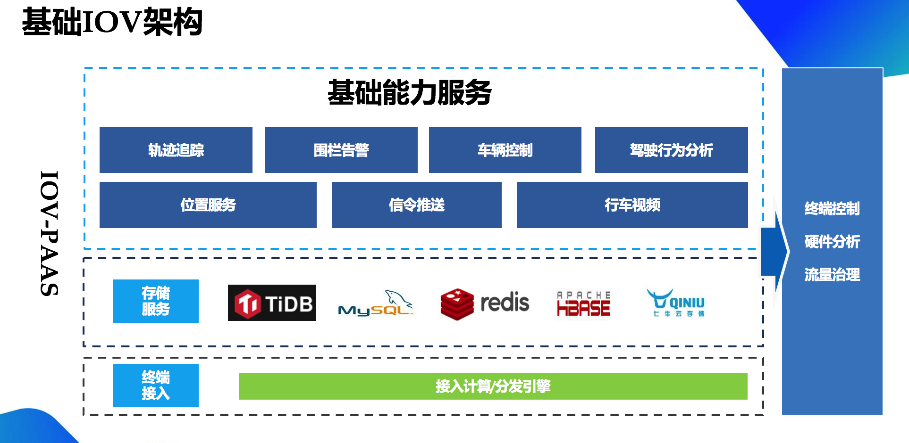
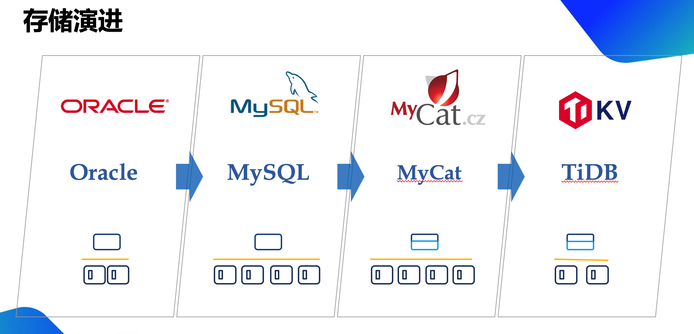

>作者简介：薛超，中移物联网有限公司数据库运维高级工程师

中移物联网有限公司是中国移动通信集团公司投资成立的全资子公司，公司按照中国移动整体战略布局，围绕“物联网业务服务的支撑者、专用模组和芯片的提供者、物联网专用产品的推动者”的战略定位， 专业化运营物联网专用网络，设计生产物联网专用模组和芯片，打造车联网、智能家居、智能穿戴等特色产品，开发运营物联网连接管理平台 OneLink 和物联网开放平台 OneNET，推广物联网解决方案，形成了五大方向业务布局和物联网“云-管-端”全方位的体系架构。

本次分享主要介绍车联网业务，它主要围绕车载位置终端和车载视频终端开展业务，包括停车卫士、路尚个人、路尚行业、和统一填装业务。截止 2020 年 5 月，累计接入 150 万终端，车联网用户主要是个人用户和企业用户，目前累计注册个人用户 151 万，累计注册企业用户 1471 个。

## 基础 IOV 架构

首先讲一下基础架构，车载设备中搭载在小汽车上的 opd 设备会根据业务类型的配置，及时发送报文到切入计算模块和分发引擎，将报文按照预先制定的协议解析，把不同的信息分发到下游不同的服务。比如，轨迹服务、告警服务。不同服务的存储媒介是不一样的，比如说轨迹放到 TiDB，位置服务放在 Redis 集群，行车视频是放在七牛的对象存储，完整的报文信息是放在 HBase 做数据分析。

## IOV 核心场景

### 场景一：设备管理模块

设备管理主要是记录车载设备的各种状态信息数据，部分数据更新频率比较高，峰值达到 1.2 万字/秒。在用 TiDB 之前设备管理是放在 Redis Cluster 里面的，放到 TiDB 里面验证，主要是想看它处理 update 语句的效率。

### 场景二：行车轨迹

行车轨迹场景主要是行车轨迹数据的写入和少量轨迹查询的请求，日均写入量在 4.5 亿行数据。目前验证集群的规模数据在 300 亿行左右，最终规模会达到 1600 亿行以上，那时就算是一个比较海量的数据了。

## 行车轨迹存储演进

2017 年，行车轨迹是跑在 Oracle 的双机 RAC 上面的，在去 IOE 的浪潮下，业务的发展受到了限制，Oracle 相关的硬件采购需求得不到集团的批准，因此我们开始考虑把整个行车轨迹的存储迁移到开源的数据库上面。当时选择了 MySQL 作为迁移方向，但是轨迹模块在 Oracle 上面体量比较大，有 8T 的数据，前期 MySQL 肯定是无法承载这样规模的业务，因此我们当时考虑将数据进行水平的切片，结合 Oracle 的环境，QPS 峰值大概是 1 万。当时把分片的数量定在三个，由代码控制具体某个设备的轨迹数据，给到具体哪一个分片。在我们验证的过程中，发现 3 个节点处理不了，于是我们扩展到 8 个节点，这个时候基本上可以承载整个轨迹服务的数据写入了，但是业务侧的逻辑又变得相当的繁重，维护的成本非常高，因此想找一个中间件来替代代码的分片功能。

于是我们选择了 MyCat，几经调整过后，由 16 台 X86 的物理机组成了 8 组 MySQL 的节点，将 Oracle 替换了下来。过程并不顺利，在使用 MyCat 的前期，写入的性能不好，队列经常积压，我们想了一些办法来优化，比如在写数据到 MyCat 之前，将每条轨迹进行一致性 hash 的计算，把 hash 值一样的数据归在一起，然后再批量写入到 MyCat，来减少把 MyCat 分发到各个 data note 的开销。另外还采用了 Twitter 的分布式自增 ID 算法 sonwflake 用于 ID 组件，改造成自增的 Big Int 类型组件，提高写入性能。

使用 MyCat 一段时间后，我们也在思考，目前的集群如果要做节点的扩容，成本高不高？风险大不大？结论是我们要花 4 到 5 天的时间来做节点扩容后的数据迁移，显然这个成本是相当昂贵的。这个时候，我们关注到了 TiDB，官方介绍这个产品支持弹性的水平扩展，能够轻松的应对高并发，海量数据场景，支持分布式事务，并且有自动的灾难恢复和故障转移功能，听上去非常的诱人，我就找研发大佬聊了这个事情，我们一拍即合，后面的事情进展很顺利，资源申请、部署环境，我们很快的把 3 个 TiDB server、3 个 TiKV 和 3 个 PD 集群布置好，开始了一系列的场景验证。

## 遇到的问题

第一个问题是在验证设备管理模块的时候，发现整个集群每一个节点的负载其实并不高，但是处理的效率比较低，导致队列有积压。为了解决这个问题，我们也咨询了官方的同事，进行了一些优化，比如调整批量的更新来减少开销，扩容一个 TiDB 的 server 节点，最重要的是把 TiDB 版本从 2.04 升级到 3.05。

另外一个问题就是热点数据，因为 MySQL 的模型组件用的是自增的 int 类型，迁移过来以后热点数据效应比较明显。为了解决这一问题，我们将主键改成 uuid，通过 shard_row_id_bits=N 这样的语句，来将数据打散，打散后数据写入的效率大大提升。听说现在 4.0 GA 版本的 AutoRandom 可以解决同样的问题，不再需要使用 uuid 作为组件，我们可以期待一下这个版本的新特性。

## TiDB 解决了哪些痛点问题

第一，它的水平扩展特性解决了 MyCat 等中间件分库分表带来的维护成本高的问题。通过无缝扩展 TiDB 和 TiKV 实力，提高系统的计算能力和存储能力。

第二，TiDB 兼容现有的 MySQL 的语法和协议，迁移成本低。我们从 MyCat 集群迁移到 TiDB 业务代码都非常少。在数据迁移方面，历史数据通过开发的迁移小工具，从 MyCat 集群读取出来，然后写到 TiDB 集群，数据是在代码层做的双写，我们很顺利的将数据迁移到了 TiDB。

第三，海量数据下，查询效率非常优秀。我们的轨迹数据是按照日期分区的，每天会写入 4 亿到 5 亿的数据，那么在这个量级的数据场景下，我们设备 ID 的查询一般在 10 毫秒就能够返回结果，能够满足我们业务场景的需求。

第四，扩容和升级非常快捷。TiDB 在版本升级方面真的非常好用，把准备工作做好之后，3、4 分钟不到就完成了整个升级，用户体验非常棒。

## TiDB 在物联网的应用前景

我们公司的核心产品是物联卡，目前卡片数量在 7 亿以上；另外一个产品是智能组网，现在有将近 1600 万的家庭网关；在智能家居和智能娱乐方面，我们有 700 万左右的摄像头和智能穿戴设备，这几个场景都是属于高并发以及海量数据的场景，我认为这些场景都是比较适合迁移到 TiDB 上面跑的。随着我们车联网场景在 TiDB 上的使用越来越成熟，未来我们会推动更多的业务，迁移到 TiDB 上面。同时，也希望 PingCAP 公司的同学们，能够给我们带来更优秀的产品。

>本文整理自薛超在 [TiDB DevCon 2020](https://pingcap.com/community-cn/devcon2020/) 上的演讲。
