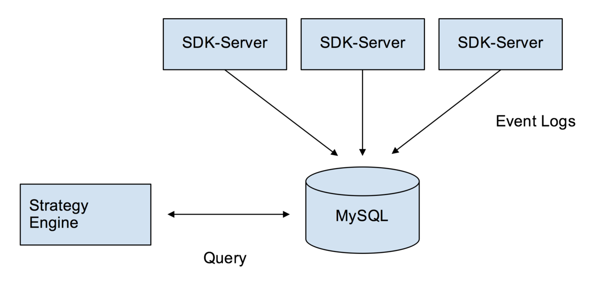
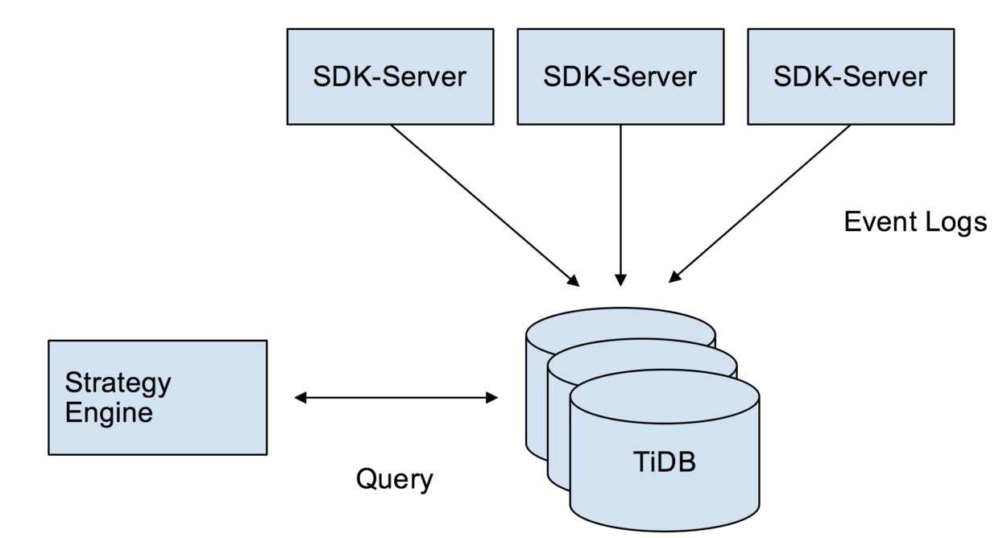
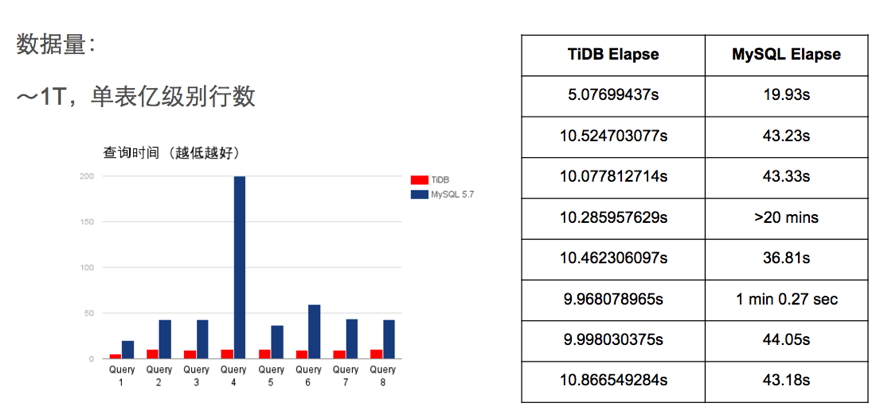

>作者简介：刘玄，盖娅互娱数据平台高级开发工程师，主要负责实时数据业务和数据流方向。毕业于湖南大学软件工程系，曾任百度高级运维工程师，负责大搜建库运维。

## 背景介绍

盖娅广告匹配系统（GaeaAD）用于支撑盖娅互娱全平台实时广告投放系统，需要将广告数据和游戏 SDK 上报的信息进行近实时匹配，本质上来说需要实时的根据各个渠道的广告投放与相应渠道带来的游戏玩家数据进行计算，实现广告转化效果分钟级别的展现及优化。

## 初期的 MySQL 存储方案

在系统设计之初，基于对数据量的预估以及简化实现方案考虑，我们选用了高可用的 MySQL RDS 存储方案，当时的匹配逻辑主要通过 SQL 语句来实现，包含了很多联表查询和聚合操作。当数据量在千万级别左右，系统运行良好，基本响应还在一分钟内。

图 1 MySQL RDS 存储方案架构图

## 遭遇瓶颈，寻找解决方案

然而随着业务的发展，越来越多游戏的接入，盖娅广告系统系统接收数据很快突破千万/日，高峰期每次参与匹配的数据量更是需要翻几个番，数据库成为了业务的瓶颈。由于此时，整个技术架构出现了一些问题：

1\. 单次匹配耗时已从原本的 10 秒左右增加到 2 分钟以上，最慢的聚合查询甚至达到 20 分钟，时效性受到严重挑战。而且 MySQL 的问题是查询的时间随着数据量的增长而增长，以至于数据量越大的情况下查询越慢。

2\. 随着历史数据的积累，单表数据很快达到亿级别，此时单表的读写压力已经接近极限。

3\. 由于第一点提到的查询性能问题以及单机的容量限制，需要定时删除数据，对于一些时间跨度较长的业务查询需求没法满足。

根据数据量的增长情况来看，分布式数据库会是很好的解决方案。首先考虑的是业务的垂直及水平拆分或者基于  MySQL 的数据库中间件方案和一些主流的 NoSQL 方案。

但是仔细评估后，最先排除掉的是业务水平拆分的方案，因为业务逻辑中包含大量的关联查询和子查询，如果拆表后这些查询逻辑就没有办法透明的兼容，而且是比较核心的业务系统，时间精力的关系也不允许整体做大的重构。中间件的问题和分库分表的问题类似，虽然解决了大容量存储和实时写入的问题，但是查询的灵活度受限，而且多个 MySQL 实例的维护成本也需要考虑。

第二个方案就是采用 NoSQL，因为此系统需要接收业务端并发的实时写入和实时查询，所以使用类似 Greenplum，Hive 或者 SparkSQL 这样的系统不太合适，因为这几个系统并不是针对实时写入设计的， MongoDB 的问题是文档型的查询访问接口对业务的修改太大，而且 MongoDB 是否能满足在这么大数据量下高效的聚合分析可能是一个问题。

所以很明显，我们当时的诉求就是能有一款数据库既能像 MySQL 一样便于使用，最好能让业务几乎不用做任何修改，又能满足分布式的存储需求，还要保证很高的复杂查询性能。

当时调研了一下社区的分布式数据库解决方案，找到了 TiDB 这个项目，因为协议层兼容 MySQL，而且对于复杂查询的支持不错，业务代码完全不用修改直接就能使用，使迁移使用成本降到极低。

## 技术转身，使用 TiDB

在部署测试的过程中，我们使用 TiDB 提供的 Syncer 工具将 TiDB 作为 MySQL Slave 接在原业务的 MySQL 主库后边观察，确保读写的兼容性以及稳定性，经过一段时间观察后，确认读写没有任何问题，业务层的读请求切换至 TiDB，随后把写的流量也切换至 TiDB 集群，完成平滑的上线。

图 2 TiDB 方案架构图

GaeaAD 系统从 2016 年 10 月上线以来，已经稳定运行了一季度多，结合实际的使用体验，我们总结了 TiDB 带来的收益，主要有以下几点：

* 用 3 个节点组成的 TiDB 集群替换了原先的高可用 MySQL RDS 后，同样数据量级下，单次匹配平均耗时从 2 分钟以上降到了 30 秒左右，后续随着 TiDB 工程师的持续优化，达到了10 秒左右。另外，我们发现，**TiDB 在数据规模越大的情况下，对比 MySQL 的优势就越明显，应该是 TiDB 自研的分布式 SQL 优化器带来的优势。**不过在数据量比较轻量的情况下，因内部通信成本，优势相比 MySQL 并不明显。

图 3 TiDB 与 MySQL 在不同数据量下的查询时间对比

* TiDB 支持自动 Sharding，业务端不用切表操作，TiDB 也不需要像传统的数据库中间件产品设定 Sharding key 或者分区表什么的，底层的存储会自动根据数据的分布，均匀的分散在集群中，存储空间和性能可以通过增加机器实现快速的水平扩展，极大地降低了运维成本。

* TiDB 支持在线不中断的滚动升级，至今直接在线升级已有 10 余次左右，没出现过一起导致线上服务中断的情况，在可用性上体验不错。

* TiDB 支持和 MySQL 的互备，这个功能很好的解决了我们业务迁移时候的过渡问题。

当前我们正在着手把 storm 集群上的 BI 系统的实时计算业务的数据存储系统从 MongoDB 替换成 TiDB（因 MongoDB 的使用门槛相对较高，运维成本大，查询方式不如传统的 SQL 灵活），后续也计划把实时性要求高、数据存储量大且存储周期较长的业务都迁移到 TiDB 上来，看上去是一个比较合适的场景。

### TiDB 工程师点评

盖娅的业务使用 TiDB 做了如下优化：

1\. 支持更多表达式下推，充分利用 TiKV 多实例的计算资源，加快计算速度；同时也尽可能将不需要用到的数据过滤掉，减小网络传输。

2\. TiDB 默认支持 HashJoin，将算子尽可能并行化，能够利用整个集群的计算资源。

3\. TiDB 采用流水线的方式读取数据，并且优化过 IndexScan 算子，降低整个流程的启动时间。

