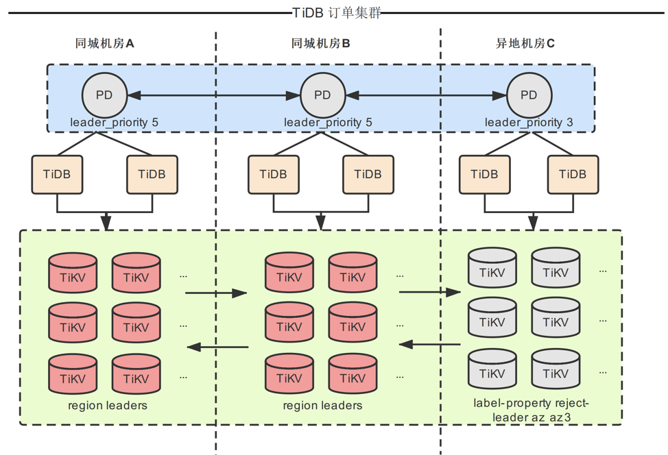
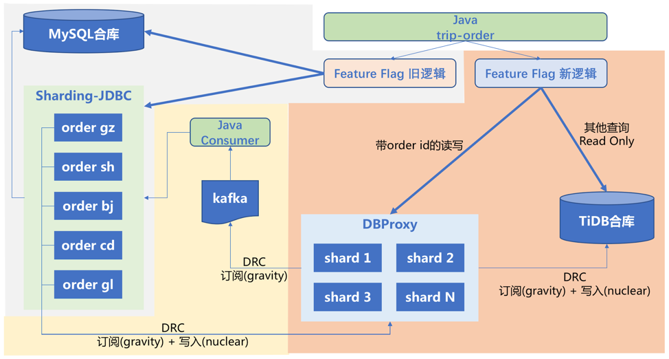
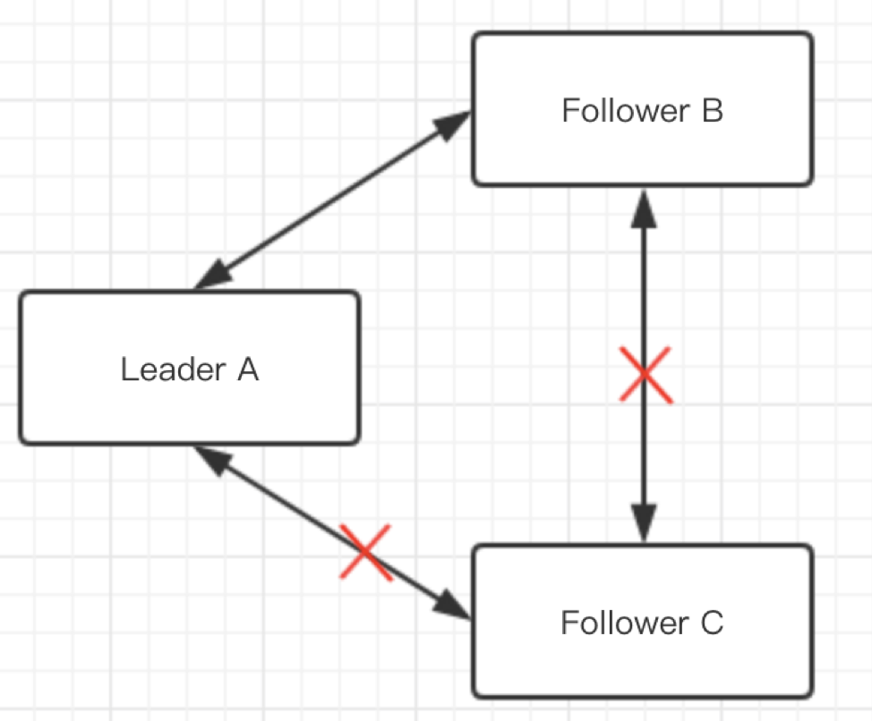
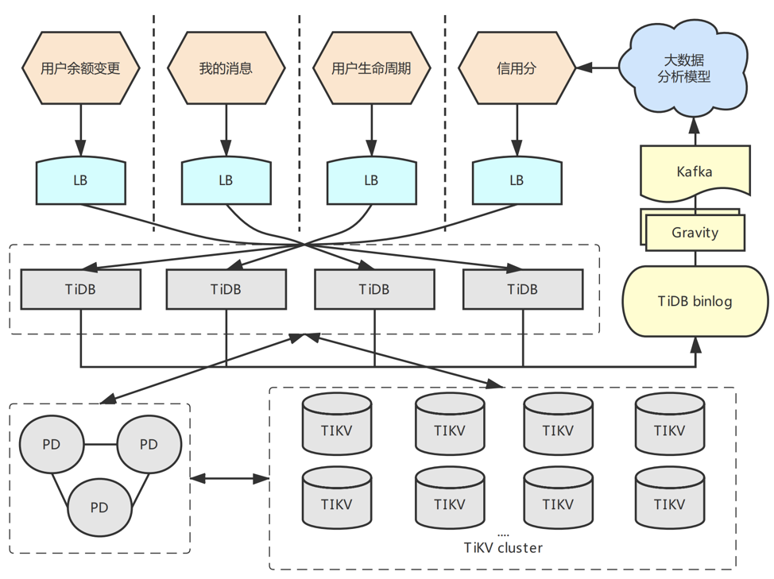
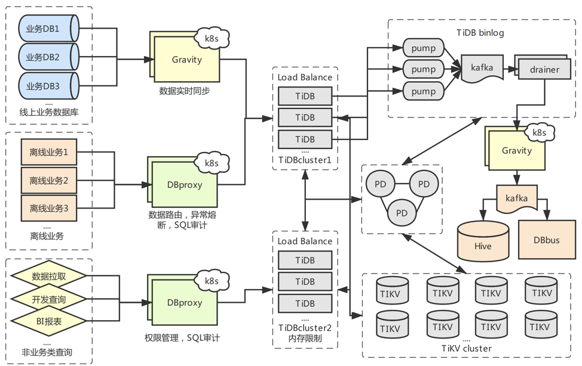
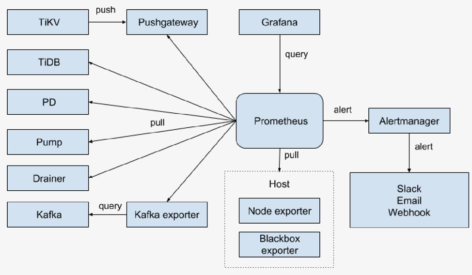

> 作者介绍：**吕磊**，摩拜单车高级 DBA。

## 一、业务场景

摩拜单车 2017 年开始将 TiDB 尝试应用到实际业务当中，根据业务的不断发展，TiDB 版本快速迭代，我们将 TiDB 在摩拜单车的使用场景逐渐分为了三个等级：

- P0 级核心业务：线上核心业务，必须单业务单集群，不允许多个业务共享集群性能，跨 AZ 部署，具有异地灾备能力。
- P1 级在线业务：线上业务，在不影响主流程的前提下，可以允许多个业务共享一套 TiDB 集群。
- 离线业务集群：非线上业务，对实时性要求不高，可以忍受分钟级别的数据延迟。

本文会选择三个场景，给大家简单介绍一下 TiDB 在摩拜单车的使用姿势、遇到的问题以及解决方案。

## 二、订单集群（P0 级业务）

订单业务是公司的 P0 级核心业务，以前的 Sharding 方案已经无法继续支撑摩拜快速增长的订单量，单库容量上限、数据分布不均等问题愈发明显，尤其是订单合库，单表已经是百亿级别，TiDB 作为 Sharding 方案的一个替代方案，不仅完美解决了上面的问题，还能为业务提供多维度的查询。

### 2.1 订单 TiDB 集群的两地三中心部署架构



<div class="caption-center">图 1 两地三中心部署架构图</div>

整个集群部署在三个机房，同城 A、同城 B、异地 C。由于异地机房的网络延迟较高，设计原则是尽量使 PD Leader 和 TiKV Region Leader 选在同城机房（Raft 协议只有 Leader 节点对外提供服务），我们的解决方案如下：

- PD 通过 Leader priority 将三个 PD server 优先级分别设置为 5 5 3。
- 将跨机房的 TiKV 实例通过 label 划分 AZ，保证 Region 的三副本不会落在同一个 AZ 内。
- 通过 label-property reject-leader 限制异地机房的 Region Leader，保证绝大部分情况下 Region 的 Leader 节点会选在同城机房 A、B。

### 2.2 订单集群的迁移过程以及业务接入拓扑



<div class="caption-center">图 2 订单集群的迁移过程以及业务接入拓扑图</div>

为了方便描述，图中 Sharding-JDBC 部分称为老 Sharding 集群，DBProxy 部分称为新 Sharding 集群。

- 新 Sharding 集群按照 `order_id` 取模通过 DBproxy 写入各分表，解决数据分布不均、热点等问题。
- 将老 Sharding 集群的数据通过使用 DRC（摩拜自研的开源异构数据同步工具 [Gravity](https://github.com/moiot/gravity)）全量+增量同步到新 Sharding 集群，并将增量数据进行打标，反向同步链路忽略带标记的流量，避免循环复制。
- 为支持上线过程中业务回滚至老 Sharding 集群，需要将新 Sharding 集群上的增量数据同步回老 Sharding 集群，由于写回老 Sharding 集群需要耦合业务逻辑，因此 DRC（Gravity）负责订阅 DBProxy-Sharding 集群的增量数放入 Kafka，由业务方开发一个消费 Kafka 的服务将数据写入到老 Sharding 集群。
- 新的 TiDB 集群作为订单合库，使用 DRC（Gravity）从新 Sharding 集群同步数据到 TiDB 中。
- 新方案中 DBProxy 集群负责 `order_id` 的读写流量，TiDB 合库作为 readonly 负责其他多维度的查询。

### 2.3 使用 TiDB 遇到的一些问题

**2.3.1 上线初期新集群流量灰度到 20% 的时候，发现 TiDB coprocessor 非常高，日志出现大量 server is busy 错误。**

问题分析：

- 订单数据单表超过 100 亿行，每次查询涉及的数据分散在 1000+ 个 Region 上，根据 index 构造的 handle 去读表数据的时候需要往这些 Region 上发送很多 distsql 请求，进而导致 coprocessor 上 gRPC 的 QPS 上升。
- TiDB 的执行引擎是以 Volcano 模型运行，所有的物理 Executor 构成一个树状结构，每一层通过调用下一层的 `Next/NextChunk()` 方法获取结果。Chunk 是内存中存储内部数据的一种数据结构，用于减小内存分配开销、降低内存占用以及实现内存使用量统计/控制，TiDB 2.0 中使用的执行框架会不断调用 Child 的 `NextChunk` 函数，获取一个 Chunk 的数据。每次函数调用返回一批数据，数据量由一个叫 `tidb_max_chunk_size` 的 session 变量来控制，默认是 1024 行。订单表的特性，由于数据分散，实际上单个 Region 上需要访问的数据并不多。所以这个场景 Chunk size 直接按照默认配置（1024）显然是不合适的。

解决方案：

- 升级到 2.1 GA 版本以后，这个参数变成了一个全局可调的参数，并且默认值改成了 32，这样内存使用更加高效、合理，该问题得到解决。

**2.3.2 数据全量导入 TiDB 时，由于 TiDB 会默认使用一个隐式的自增 rowid，大量 INSERT 时把数据集中写入单个 Region，造成写入热点。**

解决方案：

- 通过设置 [`SHARD_ROW_ID_BITS`](https://pingcap.com/docs-cn/dev/reference/configuration/tidb-server/tidb-specific-variables/#shard_row_id_bits)，可以把 rowid 打散写入多个不同的 Region，缓解写入热点问题：`ALTER TABLE table_name SHARD_ROW_ID_BITS = 8;`。

**2.3.3 异地机房由于网络延迟相对比较高，设计中赋予它的主要职责是灾备，并不提供服务。曾经出现过一次大约持续 10s 的网络抖动，TiDB 端发现大量的 no Leader 日志，Region follower 节点出现网络隔离情况，隔离节点 term 自增，重新接入集群时候会导致 Region 重新选主，较长时间的网络波动，会让上面的选主发生多次，而选主过程中无法提供正常服务，最后可能导致雪崩。**

问题分析：

- Raft 算法中一个 Follower 出现网络隔离的场景，如下图所示。



<div class="caption-center">图 3 Raft 算法中，Follower 出现网络隔离的场景图</div>

- Follower C 在 election timeout 没收到心跳之后，会发起选举，并转换为 Candidate 角色。
- 每次发起选举时都会把 term 加 1，由于网络隔离，选举失败的 C 节点 term 会不断增大。
- 在网络恢复后，这个节点的 term 会传播到集群的其他节点，导致重新选主，由于 C 节点的日志数据实际上不是最新的，并不会成为 Leader，整个集群的秩序被这个网络隔离过的 C 节点扰乱，这显然是不合理的。

解决方案：

- TiDB 2.1 GA 版本引入了 Raft PreVote 机制，该问题得到解决。
- 在 PreVote 算法中，Candidate 首先要确认自己能赢得集群中大多数节点的投票，才会把自己的 term 增加，然后发起真正的投票，其他节点同意发起重新选举的条件更严格，必须同时满足 ：
  - 没有收到 Leader 的心跳，至少有一次选举超时。
  - Candidate 日志足够新。PreVote 算法的引入，网络隔离节点由于无法获得大部分节点的许可，因此无法增加 term，重新加入集群时不会导致重新选主。

## 三、在线业务集群（P1 级业务）

在线业务集群，承载了用户余额变更、我的消息、用户生命周期、信用分等 P1 级业务，数据规模和访问量都在可控范围内。产出的 TiDB Binlog 可以通过 Gravity 以增量形式同步给大数据团队，通过分析模型计算出用户新的信用分定期写回 TiDB 集群。



<div class="caption-center">图 4 在线业务集群拓扑图</div>

## 四、数据沙盒集群（离线业务）

数据沙盒，属于离线业务集群，是摩拜单车的一个数据聚合集群。目前运行着近百个 TiKV 实例，承载了 60 多 TB 数据，由公司自研的 Gravity 数据复制中心将线上数据库实时汇总到 TiDB 供离线查询使用，同时集群也承载了一些内部的离线业务、数据报表等应用。目前集群的总写入 TPS 平均在 1-2w/s，QPS 峰值 9w/s+，集群性能比较稳定。该集群的设计优势有如下几点：

- 可供开发人员安全的查询线上数据。

- 特殊场景下的跨库联表 SQL。

- 大数据团队的数据抽取、离线分析、BI 报表。

- 可以随时按需增加索引，满足多维度的复杂查询。

- 离线业务可以直接将流量指向沙盒集群，不会对线上数据库造成额外负担。

- 分库分表的数据聚合。

- 数据归档、灾备。



<div class="caption-center">图 5  数据沙盒集群拓扑图</div>

### 4.1 遇到过的一些问题和解决方案

**4.1.1 TiDB server oom 重启**

很多使用过 TiDB 的朋友可能都遇到过这一问题，当 TiDB 在遇到超大请求时会一直申请内存导致 oom, 偶尔因为一条简单的查询语句导致整个内存被撑爆，影响集群的总体稳定性。虽然 TiDB 本身有 oom action 这个参数，但是我们实际配置过并没有效果。

于是我们选择了一个折中的方案，也是目前 TiDB 比较推荐的方案：单台物理机部署多个 TiDB 实例，通过端口进行区分，给不稳定查询的端口设置内存限制（如图 5 中间部分的 TiDBcluster1 和 TiDBcluster2）。例：

```
[tidb_servers]
tidb-01-A ansible_host=$ip_address deploy_dir=/$deploydir1 tidb_port=$tidb_port1 tidb_status_port=$status_port1
tidb-01-B ansible_host=$ip_address deploy_dir=/$deploydir2 tidb_port=$tidb_port2 tidb_status_port=$status_port2  MemoryLimit=20G
```

实际上 `tidb-01-A`、`tidb-01-B` 部署在同一台物理机，`tidb-01-B` 内存超过阈值会被系统自动重启，不影响 `tidb-01-A`。

TiDB 在 2.1 版本后引入新的参数 `tidb_mem_quota_query`，可以设置查询语句的内存使用阈值，目前 TiDB 已经可以部分解决上述问题。

**4.1.2 TiDB-Binlog 组件的效率问题**

大家平时关注比较多的是如何从 MySQL 迁移到 TiDB，但当业务真正迁移到 TiDB 上以后，TiDB 的 Binlog 就开始变得重要起来。TiDB-Binlog 模块，包含 Pump&Drainer 两个组件。TiDB 开启 Binlog 后，将产生的 Binlog 通过 Pump 组件实时写入本地磁盘，再异步发送到 Kafka，Drainer 将 Kafka 中的 Binlog 进行归并排序，再转换成固定格式输出到下游。

使用过程中我们碰到了几个问题：

- Pump 发送到 Kafka 的速度跟不上 Binlog 产生的速度。

- Drainer 处理 Kafka 数据的速度太慢，导致延时过高。

- 单机部署多 TiDB 实例，不支持多 Pump。

其实前两个问题都是读写 Kafka 时产生的，Pump&Drainer 按照顺序、单 partition 分别进行读&写，速度瓶颈非常明显，后期增大了 Pump 发送的 batch size，加快了写 Kafka 的速度。但同时又遇到一些新的问题：

- 当源端 Binlog 消息积压太多，一次往 Kafka 发送过大消息，导致 Kafka oom。

- 当 Pump 高速大批写入 Kafka 的时候，发现 Drainer 不工作，无法读取 Kafka 数据。

和 PingCAP 工程师一起排查，最终发现这是属于 sarama 本身的一个 bug，sarama 对数据写入没有阈值限制，但是读取却设置了阈值：[https://github.com/Shopify/sarama/blob/master/real_decoder.go#L88](https://github.com/Shopify/sarama/blob/master/real_decoder.go#L88)。

最后的解决方案是给 Pump 和 Drainer 增加参数 `Kafka-max-message` 来限制消息大小。单机部署多 TiDB 实例，不支持多 Pump，也通过更新 ansible 脚本得到了解决，将 `Pump.service` 以及和 TiDB 的对应关系改成 `Pump-8250.service`，以端口区分。

针对以上问题，PingCAP 公司对 TiDB-Binlog 进行了重构，新版本的 TiDB-Binlog 不再使用 Kafka 存储 binlog。Pump 以及 Drainer 的功能也有所调整，Pump 形成一个集群，可以水平扩容来均匀承担业务压力。另外，原 Drainer 的 binlog 排序逻辑移到 Pump 来做，以此来提高整体的同步性能。

**4.1.3 监控问题**

当前的 TiDB 监控架构中，TiKV 依赖 Pushgateway 拉取监控数据到 Prometheus，当 TiKV 实例数量越来越多，达到 Pushgateway 的内存限制 2GB 进程会进入假死状态，Grafana 监控就会变成下图的断点样子：



<div class="caption-center">图 6 监控拓扑图</div>


<div class="caption-center">图 7 监控展示图</div>

目前临时处理方案是部署多套 Pushgateway，将 TiKV 的监控信息指向不同的 Pushgateway 节点来分担流量。这个问题的最终还是要用 TiDB 的新版本（2.1.3 以上的版本已经支持），Prometheus 能够直接拉取 TiKV 的监控信息，取消对 Pushgateway 的依赖。

### 4.2 数据复制中心 Gravity (DRC)

下面简单介绍一下摩拜单车自研的数据复制组件 Gravity（DRC）。

Gravity 是摩拜单车数据库团队自研的一套数据复制组件，目前已经稳定支撑了公司数百条同步通道，TPS 50000/s，80 线延迟小于 50ms，具有如下特点：

- 多数据源（MySQL, MongoDB, TiDB, PostgreSQL）。
- 支持异构（不同的库、表、字段之间同步），支持分库分表到合表的同步。
- 支持双活&多活，复制过程将流量打标，避免循环复制。
- 管理节点高可用，故障恢复不会丢失数据。
- 支持 filter plugin（语句过滤，类型过滤，column 过滤等多维度的过滤）。
- 支持传输过程进行数据转换。
- 一键全量 + 增量迁移数据。
- 轻量级，稳定高效，容易部署。
- 支持基于 Kubernetes 的 PaaS 平台，简化运维任务。

使用场景：

- 大数据总线：发送 MySQL Binlog，Mongo Oplog，TiDB Binlog 的增量数据到 Kafka 供下游消费。
- 单向数据同步：MySQL → MySQL&TiDB 的全量、增量同步。
- 双向数据同步：MySQL ↔ MySQL 的双向增量同步，同步过程中可以防止循环复制。
- 分库分表到合库的同步：MySQL 分库分表 → 合库的同步，可以指定源表和目标表的对应关系。
- 数据清洗：同步过程中，可通过 filter plugin 将数据自定义转换。
- 数据归档：MySQL→ 归档库，同步链路中过滤掉 delete 语句。

Gravity 的设计初衷是要将多种数据源联合到一起，互相打通，让业务设计上更灵活，数据复制、数据转换变的更容易，能够帮助大家更容易的将业务平滑迁移到 TiDB 上面。[该项目](https://github.com/moiot/gravity) 已经在 GitHub 开源，欢迎大家交流使用。

## 五、总结

TiDB 的出现，不仅弥补了 MySQL 单机容量上限、传统 Sharding 方案查询维度单一等缺点，而且其计算存储分离的架构设计让集群水平扩展变得更容易。业务可以更专注于研发而不必担心复杂的维护成本。未来，摩拜单车还会继续尝试将更多的核心业务迁移到 TiDB 上，让 TiDB 发挥更大价值，也祝愿 TiDB 发展的越来越好。
